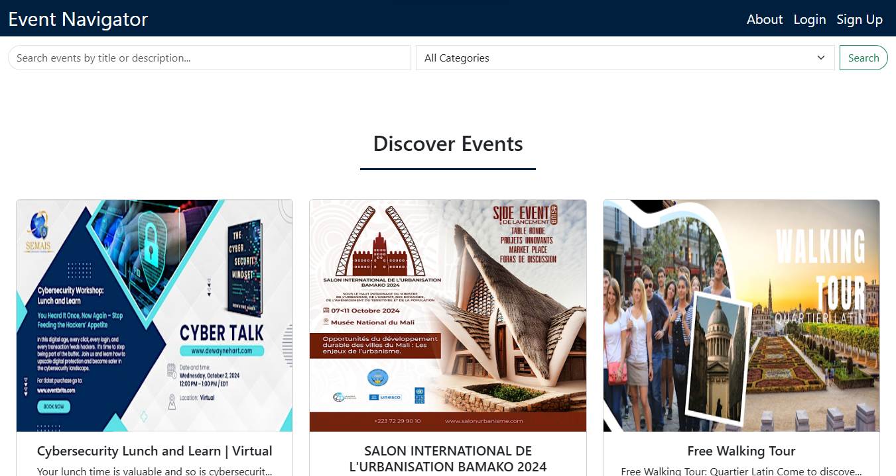
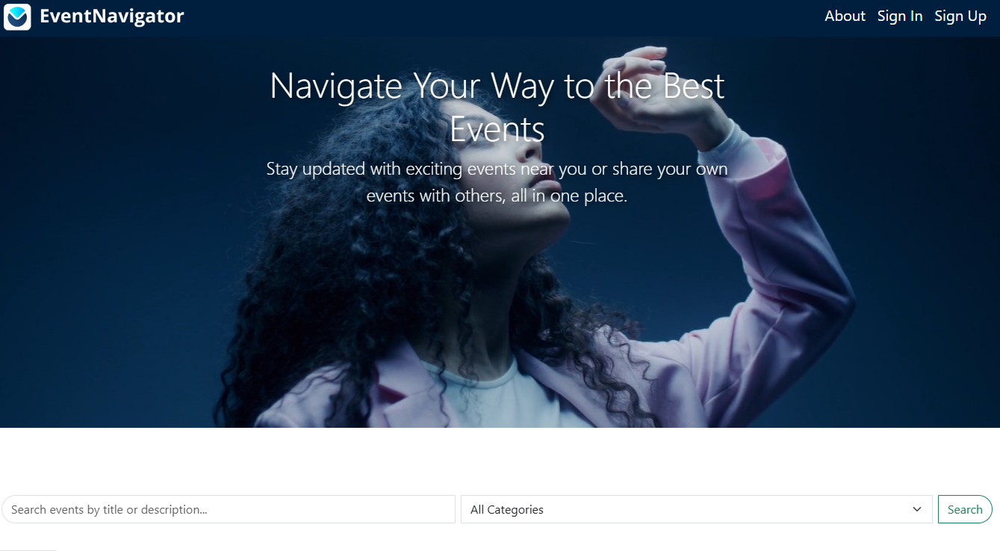
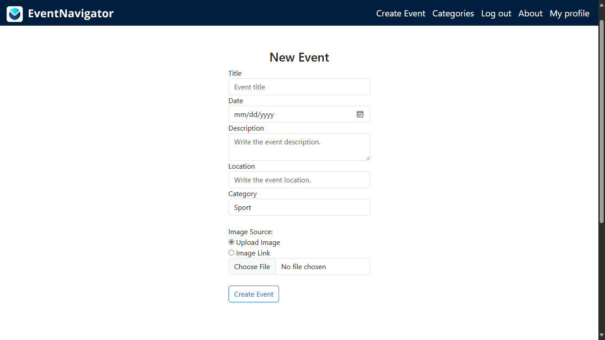
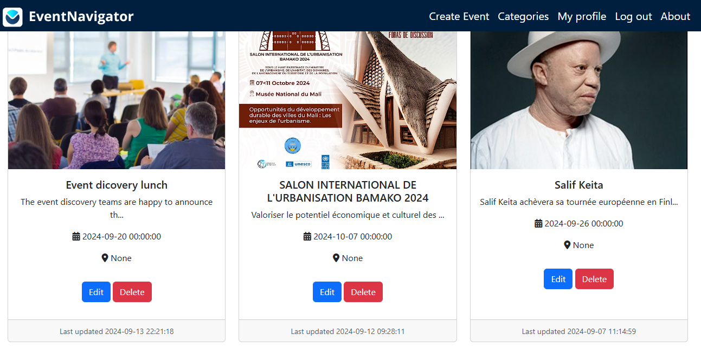

# EventNavigator

## Introduction

EventNavigator is a dynamic web application designed to help users discover and navigate events happening in various locations. Whether you're looking for a local concert, a conference, or a meetup, EventNavigator provides a seamless way to browse and post events. This project was built as a portfolio project for Holberton School. It integrates features like event management, user authentication, and a responsive UI to ensure users can access information across all devices.



[Link to the deployed site](https://www.eventnavigator.live/)
[Final Project Blog Article](https://medium.com/@brehymatraore50/eventnavigator-your-guide-to-the-best-local-events-d00d92e93c67)


# Installation

## Clone the repository:
```bash
git clone https://github.com/Bbt3-alx/EventNavigator.git
```
## Navigate to the project directory:
```bash
cd EventNavigator
```
## Install dependencies:
```bash
pip install -r requirements.txt
```

## Database Setup
1. Set up a MySQL database on your machine or on a remote server.

2. Create a `.env` file in the root directory of the project with the following content:

```bash
MYSQL_USER=your_mysql_username
MYSQL_PASSWORD=your_mysql_password
MYSQL_HOST=localhost
MYSQL_PORT=3306
MYSQL_DATABASE=event_navigator
```

3. Install python-dotenv if you haven't:
`pip install python-dotenv`

4. Run the following commands to set up the database schema:
`flask db upgrade`

## Run the application:
`flask run`

## Usage

## 1. Register or log in to access the full features of EventNavigator.


## 2. Search for events using the search bar or browse by category.



# 4. Post an event by clicking the "Create Event" button (authentication required).



## 6. Manage your events via the profile page.



## API

EventNavigator offers a RESTful API for developers. Here's a list of available endpoints:

## Retrieve all events:
GET /api/v1/events

## Retrieve a specific event:
GET /api/v1/events/:id

## Create a new event (requires authentication):
POST /api/v1/events

## Contributing
We welcome contributions to EventNavigator! Please follow these steps:

## Fork the repository.

## Create a new feature branch:
git checkout -b features

## Make your changes and commit:
git commit -m "Add new feature"

## Push to the branch:
git push origin features

## Open a pull request and describe the changes in detail.

## Author(s)
- [LinkedIn](https://linkedin.com/in/brehyma-traore-7a0454186)
- [Brehyma Traore](https://github.com/Bbt3-alx)
- [Twitter](https://twitter.com/BrehymaTraore)

## Licence
This project is licensed under the MIT License.
